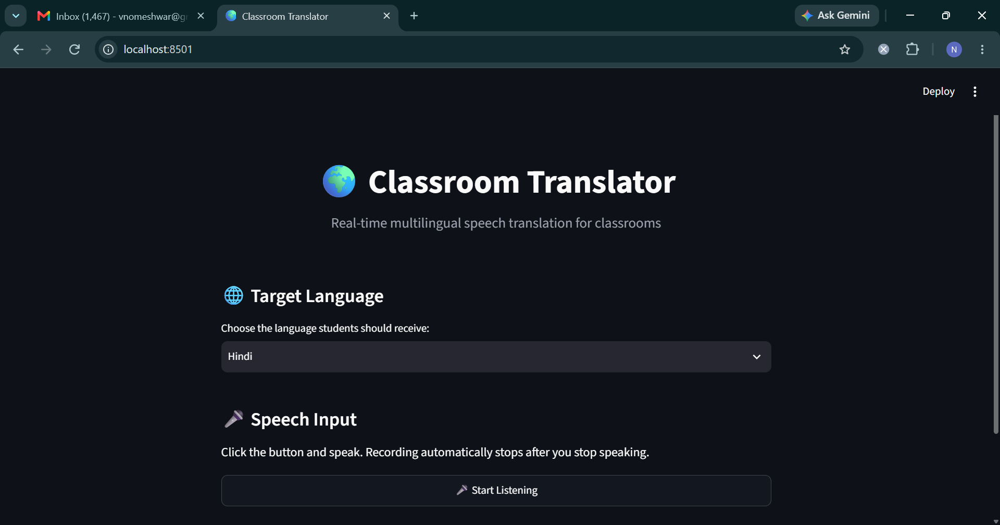
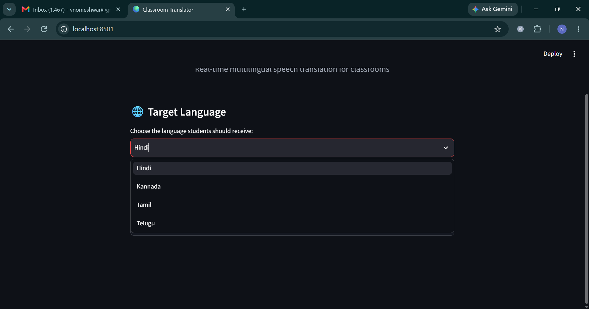
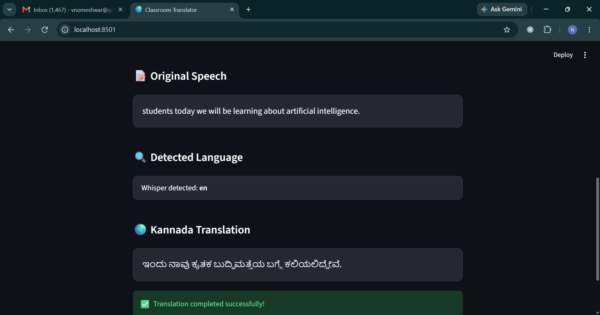

# Real-Time Multilingual Classroom Translation System

## 1. Project Overview

The Real-Time Multilingual Classroom Translation System is a speech-based multilingual translation application designed to help teachers communicate with students who speak different languages.

The application captures classroom speech through a microphone, automatically detects when the speaker starts and stops speaking, converts speech into text using OpenAI Whisper, detects the source language, and translates the resulting text into a selected target language using Meta's NLLB-200 model.

The application is implemented using Python and Streamlit and provides an interactive interface for recording speech, viewing the transcription, viewing the translated output, and maintaining translation history during the current session.

## 2. Application Screenshots

### 2.1 Application Preview

The main application interface provides access to speech recording, target-language selection, and translation.



### 2.2 Target Language Selection

Users can select the language in which the classroom speech should be translated.



### 2.3 Translation Output

After recording, the application displays the original speech, detected source language, translated text, and translation history.



## 3. Problem Statement

In multilingual classrooms, language differences can make communication between teachers and students difficult.

Traditional translation workflows require users to manually record speech, convert it into text, and translate the text using separate tools.

This project combines these steps into a single application:

```text
Speech
   |
   v
Automatic Speech Detection
   |
   v
Audio Recording
   |
   v
Speech-to-Text
   |
   v
Language Detection
   |
   v
Machine Translation
   |
   v
Translated Text
```

The goal is to provide a simple and automated workflow for classroom speech translation.

## 4. Key Features

- Automatic speech detection and recording
- Automatic recording start when speech is detected
- Automatic recording stop after a configurable silence period
- Speech-to-text conversion using OpenAI Whisper
- Automatic source-language detection
- Multilingual translation using Meta NLLB-200
- Support for Hindi, Kannada, Tamil, and Telugu
- Streamlit-based interactive web interface
- Translation history within the current session
- Cached ML models for faster repeated requests
- Modular Python project structure

## 5. System Architecture

```text
                         User
                           |
                           v
                  Streamlit Web UI
                           |
                           v
                  Speech Recorder
                           |
                           v
                    Audio File
                           |
                           v
                    OpenAI Whisper
                     /          \
                    /            \
                   v              v
             Transcribed       Detected
                Text            Language
                   \              /
                    \            /
                     v          v
                   Language Mapping
                           |
                           v
                       NLLB-200
                           |
                           v
                    Target Language
                           |
                           v
                    Translated Text
                           |
                           v
                    Streamlit UI
                           |
                           v
                 Translation History
```

## 6. Technology Stack

| Technology | Purpose |
|---|---|
| Python | Application and ML pipeline development |
| Streamlit | Web-based user interface |
| OpenAI Whisper | Speech recognition and language detection |
| NLLB-200 | Multilingual machine translation |
| Hugging Face Transformers | Loading and running NLLB |
| PyTorch | Deep learning model execution |
| SoundDevice | Microphone audio capture |
| NumPy | Numerical and audio signal processing |
| SciPy | WAV file creation |
| FFmpeg | Audio processing required by Whisper |

## 7. Project Structure

```text
realtime-multilingual-classroom-translation/
|
├── app.py
├── requirements.txt
├── README.md
├── .gitignore
|
├── src/
│   ├── __init__.py
│   ├── recorder.py
│   ├── transcription.py
│   ├── translator.py
│   └── language_config.py
|
├── tests/
|
├── assets/
│   ├── preview.png
│   ├── language-selection.png
│   └── output.png
|
└── old_experiments/
```

## 8. Module Responsibilities

### `app.py`

The main Streamlit application.

It is responsible for:

- Rendering the user interface
- Allowing the user to select a target language
- Starting the speech-recording process
- Calling the transcription module
- Calling the translation module
- Displaying the original speech
- Displaying the detected language
- Displaying the translated text
- Maintaining translation history

### `src/recorder.py`

Responsible for microphone input and automatic speech detection.

The recorder continuously monitors the microphone and calculates the audio signal volume.

When the volume crosses the configured speech threshold, recording begins.

When the speaker stops talking and the audio remains below the threshold for the configured silence duration, recording stops automatically.

Current configuration:

```python
SAMPLE_RATE = 16000
BLOCK_SIZE = 1024
THRESHOLD = 0.02
SILENCE_LIMIT = 1.5
MIN_SPEECH_TIME = 0.3
```

### `src/transcription.py`

Responsible for speech recognition.

The module:

1. Loads the Whisper model.
2. Accepts a recorded WAV file.
3. Converts speech into text.
4. Returns the detected source language.

The application currently uses the Whisper `base` model.

### `src/translator.py`

Responsible for machine translation.

The module uses:

```text
facebook/nllb-200-distilled-600M
```

It accepts the source text, source language, and target language and returns the translated text.

### `src/language_config.py`

Contains supported languages and mappings between Whisper and NLLB language codes.

Example:

```text
Whisper code     NLLB code
--------------------------
en               eng_Latn
hi               hin_Deva
kn               kan_Knda
ta               tam_Taml
te               tel_Telu
```

## 9. Supported Languages

| Language | NLLB Language Code |
|---|---|
| Hindi | `hin_Deva` |
| Kannada | `kan_Knda` |
| Tamil | `tam_Taml` |
| Telugu | `tel_Telu` |

The language configuration is separated into its own module so additional languages can be added without modifying the main application logic.

## 10. Application Workflow

### Step 1: Select Target Language

The user selects the language in which the translated output should be displayed.

### Step 2: Start Listening

The user selects the Start Listening button.

The application starts monitoring microphone input.

### Step 3: Detect Speech

The recorder calculates the audio volume for each incoming audio block.

If the volume exceeds the configured threshold for the minimum speech duration, the application considers this to be speech.

### Step 4: Record Speech

The audio is continuously collected while the user is speaking.

### Step 5: Detect End of Speech

When the audio volume remains below the threshold for the configured silence duration, recording stops automatically.

The recorded audio is saved as a WAV file.

### Step 6: Transcribe Speech

The WAV file is passed to Whisper.

Whisper returns:

```text
Transcribed text
Detected language
```

### Step 7: Map Language Codes

Whisper and NLLB use different language-code formats.

The application maps the Whisper language code to the corresponding NLLB language code.

For example:

```text
Whisper:
en

NLLB:
eng_Latn
```

### Step 8: Translate

The transcription is passed to NLLB along with the source and target language codes.

Example:

```text
Source: English
Target: Kannada

Input:
Good morning students

Output:
ಶುಭೋದಯ ವಿದ್ಯಾರ್ಥಿಗಳೇ
```

### Step 9: Display Results

The Streamlit interface displays:

- Original speech
- Detected source language
- Translated text
- Translation history

## 11. Performance Optimization

Whisper and NLLB are large machine learning models. Loading these models repeatedly for every user interaction introduces unnecessary overhead.

The application therefore uses Streamlit resource caching:

```python
@st.cache_resource
```

The models are loaded once and reused for subsequent interactions.

Without caching:

```text
Request
   |
   v
Load model
   |
   v
Process audio
   |
   v
Request again
   |
   v
Load model again
```

With caching:

```text
First request
   |
   v
Load model
   |
   v
Keep model in memory
   |
   v
Subsequent requests
   |
   v
Reuse existing model
```

This reduces repeated model initialization and improves application responsiveness.

## 12. Installation

### Prerequisites

- Python 3.x
- FFmpeg
- Git
- Working microphone

### Clone the Repository

```bash
git clone <your-github-repository-url>
cd realtime-multilingual-classroom-translation
```

### Create a Virtual Environment

```powershell
python -m venv venv
```

### Activate the Environment

Windows PowerShell:

```powershell
venv\Scripts\Activate.ps1
```

### Install Dependencies

```powershell
pip install -r requirements.txt
```

### Verify FFmpeg

```powershell
ffmpeg -version
```

FFmpeg must be available through the system PATH.

## 13. Running the Application

Run:

```powershell
streamlit run app.py
```

The application will open in a browser.

The default local address is generally:

```text
http://localhost:8501
```

## 14. Translation History

The application maintains translation history using Streamlit session state.

Each translation stores:

- Original text
- Translated text
- Detected source language
- Selected target language

The history is maintained for the current application session.

A Clear Translation History option is also available.

## 15. Error Handling

The application includes basic validation for:

- No speech detected
- Empty transcription
- Unsupported source language
- Missing translation mapping

If Whisper detects a language that has not been configured for translation, the application displays an error instead of attempting an unsupported translation.

## 16. Design Decisions

### Why Whisper?

Whisper provides speech recognition and automatic language identification in a single model.

It supports multiple languages and is suitable for converting classroom speech into text before translation.

### Why NLLB-200?

NLLB-200 is designed for multilingual machine translation and supports a large number of languages.

It is particularly useful for this project because the application is intended to support multiple Indian languages.

### Why Streamlit?

Streamlit provides a simple way to build an interactive Python-based interface without requiring a separate frontend framework.

This allows the ML pipeline and user interface to be developed within the same Python project.

### Why Modularize the Application?

The application separates recording, transcription, translation, and language configuration into different modules.

This improves:

- Maintainability
- Readability
- Testing
- Reusability
- Debugging
- Future development

## 17. Current Limitations

The current implementation is a working prototype and has several limitations:

- Translation is processed after recording rather than continuously during speech.
- Audio is temporarily stored as a WAV file.
- The application is primarily designed for local execution.
- Current voice activity detection is based on audio-volume thresholds.
- GPU acceleration has not been configured.
- Translation history is stored only for the current Streamlit session.
- The application does not currently provide translated speech output.

## 18. Future Improvements

Potential improvements include:

1. Implement true streaming speech recognition and translation.
2. Replace basic volume-based detection with a dedicated Voice Activity Detection model.
3. Add additional Indian and international languages.
4. Add text-to-speech output for translated text.
5. Add persistent translation history using a database.
6. Add GPU support for faster model inference.
7. Add model quantization or optimized inference for CPU environments.
8. Add automated unit and integration tests.
9. Containerize the application using Docker.
10. Deploy the application to a cloud environment.
11. Add authentication and multi-user classroom support.
12. Add monitoring and performance metrics.

## 19. Project Status

**Status: Working Prototype**

The current implementation successfully demonstrates the complete pipeline:

```text
Microphone Input
       |
       v
Automatic Speech Detection
       |
       v
Audio Recording
       |
       v
Whisper Speech Recognition
       |
       v
Language Detection
       |
       v
NLLB-200 Translation
       |
       v
Streamlit Interface
       |
       v
Translation History
```

The project is structured so that individual components can be independently improved and tested as development continues.

## 20. Author

Nomeshwar V